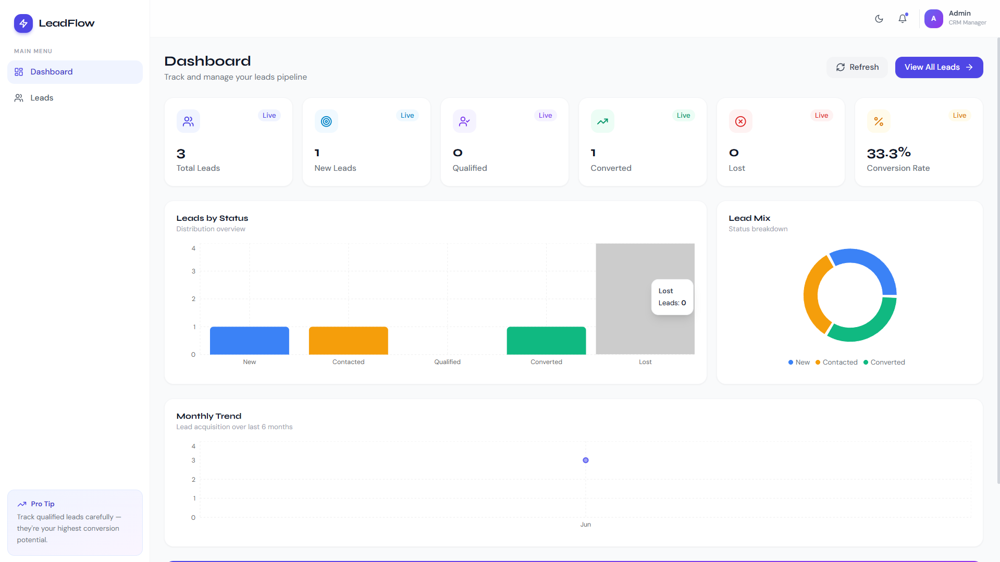

# LeadFlow CRM

> A full-stack Lead Management CRM built with React, Node.js, Express.js, and MongoDB. Manage leads, track customer interactions, monitor lead status, and streamline your sales pipeline.


---

## 📋 Table of Contents

- [Project Overview](#-project-overview)
- [Features](#-features)
- [Tech Stack](#-tech-stack)
- [Installation](#-installation)
- [Environment Variables](#-environment-variables)
- [API Endpoints](#-api-endpoints)
- [Screenshots](#-screenshots)
- [Deployment](#-deployment)
- [Development](#-development)
- [Troubleshooting](#-troubleshooting)
- [Author](#-author)

---

## 🎯 Project Overview

**LeadFlow CRM** is a comprehensive lead management solution designed for sales teams and businesses to:
- Organize and track potential customers (leads)
- Monitor lead status through multiple stages (New → Contacted → Qualified → Converted/Lost)
- Search and filter leads efficiently
- Track lead statistics and conversion metrics
- Manage lead information with a user-friendly interface

The application features a responsive user interface, RESTful API architecture, MongoDB database integration, lead analytics dashboard, and complete CRUD functionality for efficient lead management.
---

## ✨ Features

### Lead Management
- ✅ **Create Leads** - Add new prospects with comprehensive information
- ✅ **View All Leads** - Display all leads in a centralized dashboard
- ✅ **Edit Leads** - Update lead details and status
- ✅ **Delete Leads** - Remove leads from the system
- ✅ **Lead Search** - Real-time search across lead names, emails, and companies

### Filtering & Organization
- 🔍 **Advanced Filtering** - Filter leads by status (New, Contacted, Qualified, Converted, Lost)
- 📊 **Status Tracking** - Monitor leads through 5 different pipeline stages
- 📄 **Pagination** - Navigate large datasets efficiently
- 🔄 **Sorting** - Sort by creation date, name, or other fields

### Analytics & Insights
- 📈 **Dashboard Statistics** - View lead count by status
- 📊 **Conversion Metrics** - Track sales pipeline health
- 📉 **Dynamic Dashboard Updates** - Automatically refreshes data after CRUD operations

### User Experience
- 🌓 **Dark Mode** - Toggle between light and dark themes
- 📱 **Responsive Design** - Works seamlessly on desktop, tablet, and mobile
- ⚡ **Fast Performance** - Optimized with Vite and React
- 🎨 **Modern UI** - Tailwind CSS with professional design

### Developer Features
- 🔐 **CORS Support** - Flexible development and production configurations
- 📝 **Form Validation** - Client-side validation with React Hook Form
- 🚀 **RESTful API** - Clean, well-structured API endpoints
- 📊 **Request Logging** - Morgan middleware for request tracking
- 🐛 **Error Handling** - Comprehensive error handling and user feedback

---

## 🛠 Tech Stack

### Frontend
| Technology | Version | Purpose |
|------------|---------|---------|
| **React** | 18+ | UI library and component framework |
| **Vite** | 5+ | Lightning-fast build tool and dev server |
| **Tailwind CSS** | 3+ | Utility-first CSS framework |
| **React Hook Form** | 7+ | Efficient form state management |
| **Axios** | Latest | HTTP client for API requests |
| **Lucide React** | Latest | Beautiful icon library |
| **React Hot Toast** | Latest | Elegant toast notifications |

### Backend
| Technology | Version | Purpose |
|------------|---------|---------|
| **Node.js** | 20+ | JavaScript runtime |
| **Express.js** | 4+ | Web framework |
| **MongoDB** | 4.0+ | NoSQL database |
| **Mongoose** | 8+ | MongoDB ODM |
| **CORS** | Latest | Cross-Origin Resource Sharing |
| **Morgan** | Latest | HTTP request logger |
| **Dotenv** | Latest | Environment variable management |

### Tools & Services
| Tool | Purpose |
|------|---------|
| **npm** | Package management |
| **Git** | Version control |
| **MongoDB Atlas** | Cloud database hosting |
| **Render** | Cloud deployment |
| **Vercel** | Frontend deployment |

---

## 📦 Installation

### Prerequisites
Before you begin, ensure you have the following installed:
- **Node.js** (v20.0 or higher) - [Download](https://nodejs.org/)
- **MongoDB** (v4.0 or higher) - [Download](https://www.mongodb.com/try/download/community)
- **npm** (v9.0 or higher) - Usually comes with Node.js
- **Git** - [Download](https://git-scm.com/)

### Step 1: Clone the Repository
```bash
git clone https://github.com/Hrithikdoi/leadflow-crm.git
cd leadflow-crm/crm-app
```

### Step 2: Install Backend Dependencies
```bash
cd backend
npm install
```

### Step 3: Install Frontend Dependencies
```bash
cd ../frontend
npm install
```

### Step 4: Configure Environment Variables

Create `.env` files in both the backend and frontend directories using the examples provided in the Environment Variables section below.

### Step 5: Start MongoDB
Ensure MongoDB is running on your system:

**Windows (if installed as service):**
```bash
net start MongoDB
```

**macOS (with Homebrew):**
```bash
brew services start mongodb-community
```

**Linux:**
```bash
sudo systemctl start mongod
```

**Or start MongoDB directly:**
```bash
mongod
```

### Step 6: Start the Backend Server
```bash
cd backend
npm start
```

Expected output:
```
🚀 Server running in development mode on port 5000
✅ MongoDB Connected: localhost
```

### Step 7: Start the Frontend Development Server (in a new terminal)
```bash
cd frontend
npm run dev
```

Expected output:
```
VITE v5.x.x ready in xxx ms
➜ Local: http://localhost:5173/
```

### Step 8: Access the Application
Open your browser and navigate to:
```
http://localhost:5173
```

---

## 🔑 Environment Variables

### Backend (`backend/.env`)

```env
# Server Configuration
PORT=5000
NODE_ENV=development

# MongoDB Configuration
MONGO_URI=mongodb://localhost:27017/crm_db

# CORS Configuration
FRONTEND_URL=http://localhost:5173
```

**Environment Variable Descriptions:**

| Variable | Default | Description |
|----------|---------|-------------|
| `PORT` | 5000 | Port where Express server runs |
| `NODE_ENV` | development | Application environment (development/production) |
| `MONGO_URI` | mongodb://localhost:27017/crm_db | MongoDB connection string |
| `FRONTEND_URL` | http://localhost:5173 | Frontend URL for CORS configuration |

### Frontend (`frontend/.env`)

```env
# API Configuration
VITE_API_URL=http://localhost:5000/api
```

**Environment Variable Descriptions:**

| Variable | Default | Description |
|----------|---------|-------------|
| `VITE_API_URL` | http://localhost:5000/api | Backend API base URL |

### Development vs Production

### Development vs Production

**Development**
- Local MongoDB
- Frontend: http://localhost:5173
- Backend: http://localhost:5000

**Production**
- MongoDB Atlas
- Frontend deployed on Vercel
- Backend deployed on Render

---

## 🔌 API Endpoints

### Base URL

http://localhost:5000/api

### Lead Endpoints

| Method | Endpoint | Description |
|----------|----------|----------|
| GET | /leads | Get all leads |
| GET | /leads/search | Search leads |
| GET | /leads/stats | Get lead statistics |
| GET | /leads/:id | Get a single lead |
| POST | /leads | Create a new lead |
| PUT | /leads/:id | Update a lead |
| DELETE | /leads/:id | Delete a lead |

### Example Create Lead Request

POST /leads

{
  "name": "John Doe",
  "email": "john@example.com",
  "phone": "9876543210",
  "company": "Tech Corp",
  "status": "New",
  "notes": "Interested in enterprise plan"
}

---

## 📸 Screenshots

### Dashboard

*The main dashboard displays lead statistics, charts, and recent activity*

### Leads Table

*View all leads with pagination, filtering, and search functionality*

### Create Lead Modal

*Modal form for adding new leads with validation*

### Lead Filters

*Advanced filtering by status and other criteria*

### Light Mode

*Clean and responsive light theme interface*

---

## 🚀 Deployment

### Render (Backend) + Vercel (Frontend)

**Backend Deployment to Render:**
1. Create account at [render.com](https://render.com)
2. Create new Web Service
3. Connect GitHub repository
4. Set Start Command: `npm start`
5. Add Environment Variables:
   ```
   NODE_ENV=production
   MONGO_URI=mongodb+srv://...
   FRONTEND_URL=https://your-frontend.vercel.app
   ```
6. Deploy

**Frontend Deployment to Vercel:**
1. Create account at [vercel.com](https://vercel.com)
2. Import project from GitHub
3. Set Framework: Vite
4. Add Environment: `VITE_API_URL=https://your-backend.onrender.com/api`
5. Deploy

---

## 💻 Development

### Available Scripts

**Backend:**
```bash
npm start          # Start development server
```

**Frontend:**
```bash
npm run dev        # Start with HMR
npm run build      # Production build
npm run preview    # Preview production build
```

### Project Structure

```
leadflow-crm/crm-app/
├── backend/
│   ├── config/
│   │   └── db.js
│   ├── controllers/
│   │   └── leadController.js
│   ├── middleware/
│   │   └── errorMiddleware.js
│   ├── models/
│   │   └── Lead.js
│   ├── routes/
│   │   └── leadRoutes.js
│   ├── .env
│   ├── package.json
│   └── server.js
│
├── frontend/
│   ├── src/
│   │   ├── components/
│   │   ├── hooks/
│   │   ├── pages/
│   │   ├── services/
│   │   └── App.jsx
│   ├── .env
│   ├── package.json
│   └── vite.config.js
│
└── README.md
```

---

## 🐛 Troubleshooting

### Port Already in Use
```bash
# Windows
netstat -ano | findstr :5000
taskkill /PID <PID> /F

# macOS/Linux
lsof -ti:5000 | xargs kill -9
```

### CORS Errors
Verify `FRONTEND_URL` in backend `.env` matches your frontend URL exactly.

### Module Not Found
```bash
npm install
```

---

## 👤 Author

**Hrithik Doiphode**
- GitHub: https://github.com/Hrithikdoi
- Email: hrithikdoi1@gmail.com
- LinkedIn: https://www.linkedin.com/in/hrithik-doiphode/

---

**Version:** 1.0.0  
**Last Updated:** June 2026
